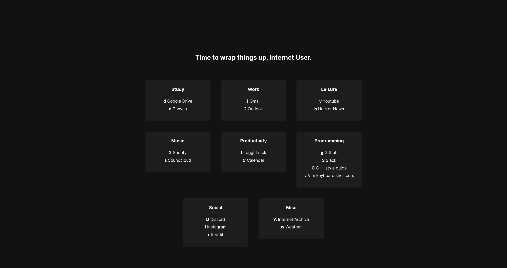
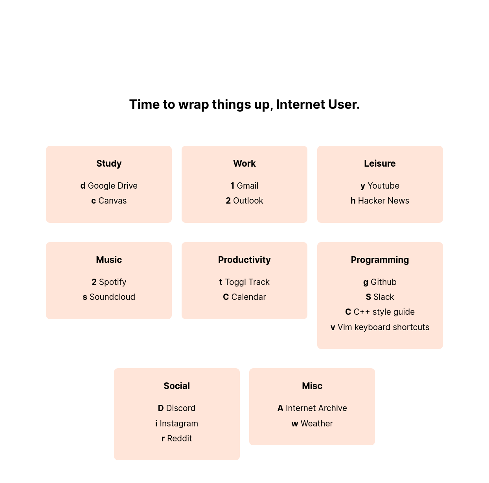
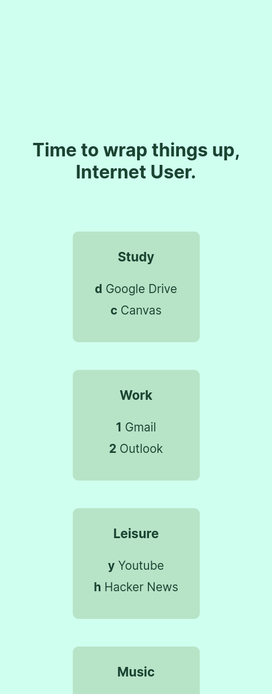

<h2></h2> 

 <b>Nue Startpage</b>

<h2></h2> 

    
    
    

## Why should I use this startpage?
Github has a lot of startpage repos. However, the vast majority of them are slow to load or require the internet (see [Bento](https://github.com/migueravila/Bento)). Rather than use some framework or spin up a GitHub Pages server, why not just load a few files using very basic HTML/CSS/JS?

## Features
* Time of day message
* Custom theming (can also load themes depending on the time of day)
* Bookmark groups
* Keyboard shortcuts to each bookmark link (inspired by [tilde](https://github.com/xvvvyz/tilde))
* 100% guaranteed to work with any screen/window size and not look broken, I swear
* NO BLOATED FRAMEWORK OR LIBRARY OR SERVER NEEDED!

## Installation
For now, I recommend signing Nue Startpage as a web extension per deepjyoti30's instructions [for his startpage](https://github.com/deepjyoti30/startpage/wiki/Installation).

## Configuration
The configuration is part of script.js.
All the needed/optional values are included and should be pretty self explanatory.

## Anything else?
Feel free to contribute, and if you share this or use some part of it in your own work, please give credit.
